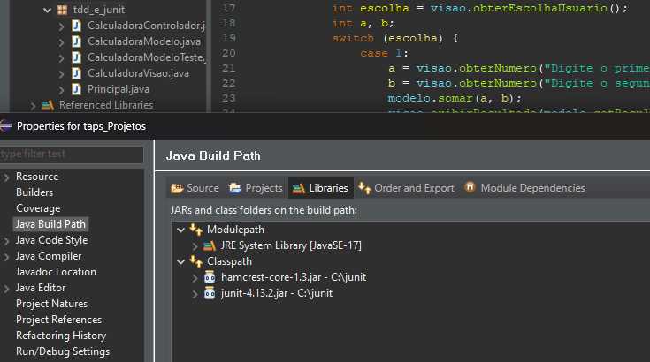
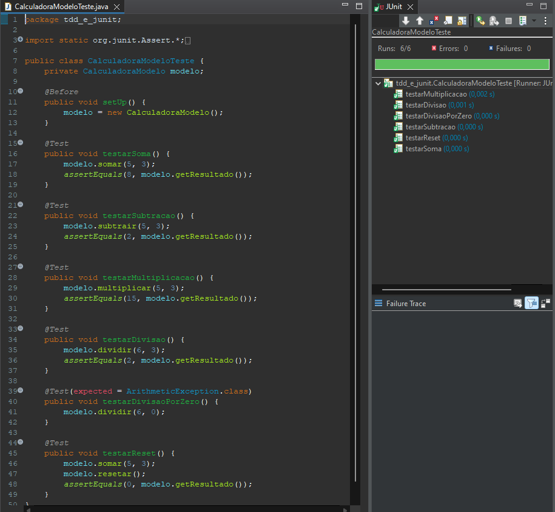
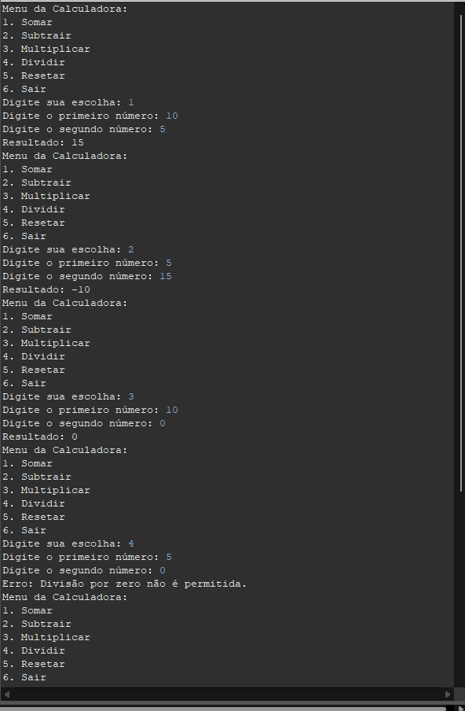
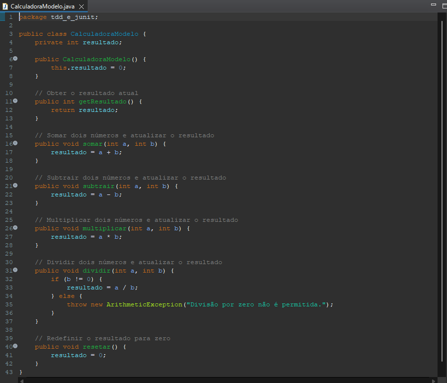
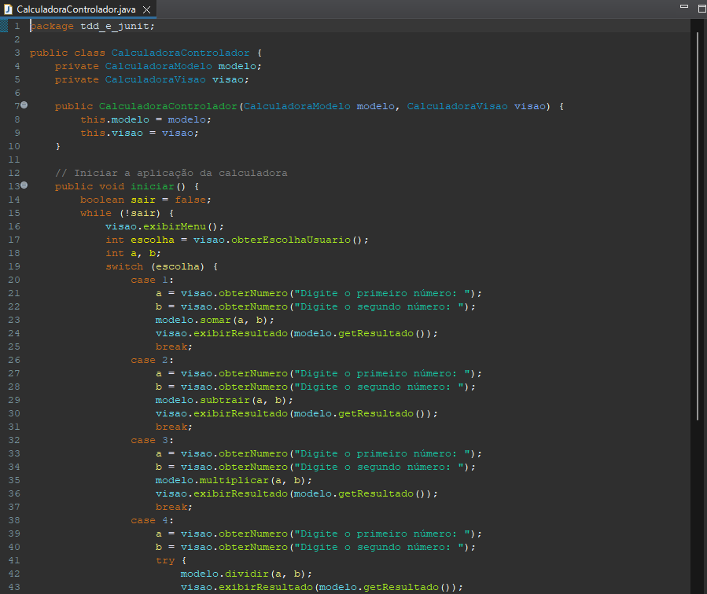
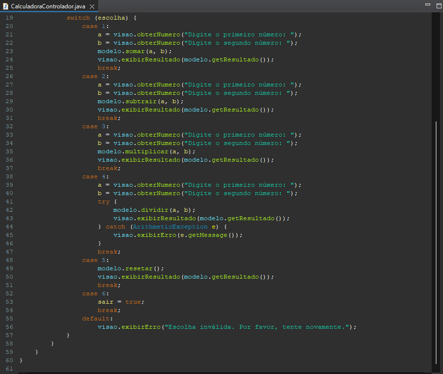
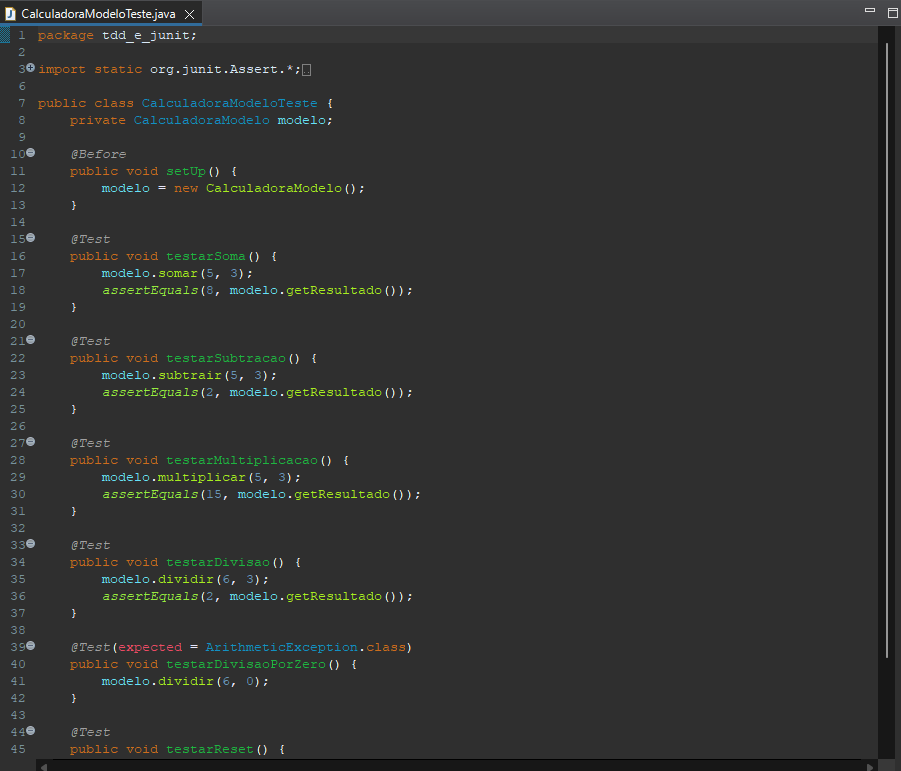
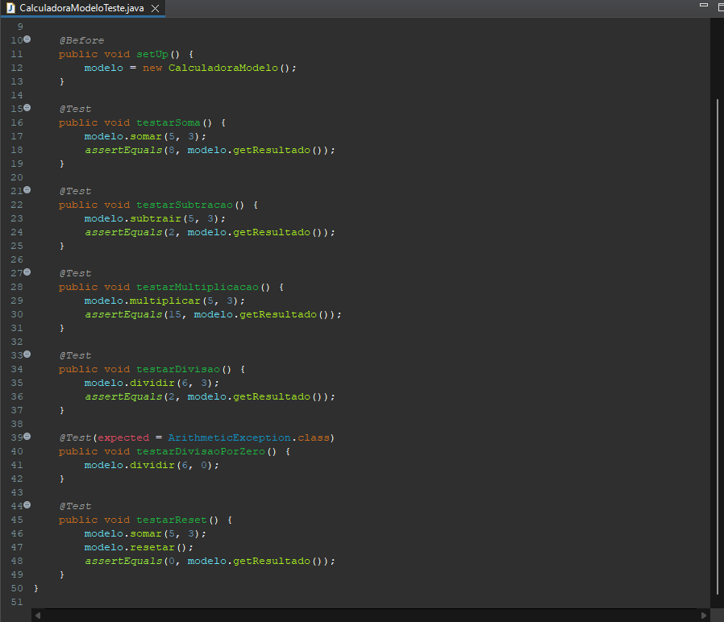
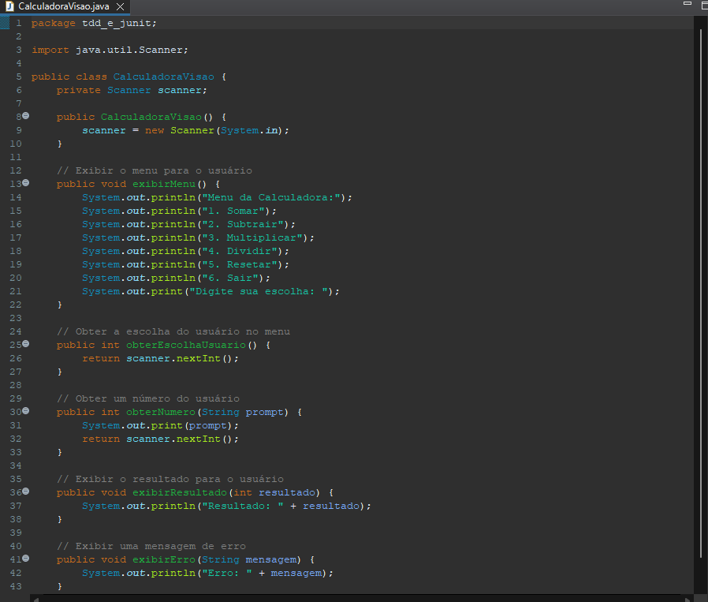
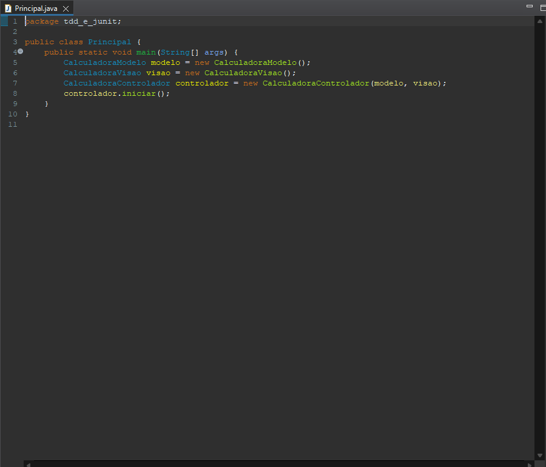

# 🧮 Calculadora Simples com TDD

Esse projeto implementa uma calculadora simples usando o conceito de Test-Driven Development (TDD).


Configuração inicial do JUnit

## 📋 Índice

- [🧮 Calculadora Simples com TDD](#-calculadora-simples-com-tdd)
  - [📋 Índice](#-índice)
  - [📖 Sobre](#-sobre)
  - [🚀 Instalação](#-instalação)
    - [Configuração do JUnit no Eclipse](#configuração-do-junit-no-eclipse)
  - [💻 Uso](#-uso)
  - [🧪 Testes](#-testes)
    - [Executando os Testes](#executando-os-testes)
    - [Resultados dos Testes](#resultados-dos-testes)
    - [Capturas de Tela dos Testes](#capturas-de-tela-dos-testes)
      - [Código da Calculadora](#código-da-calculadora)
      - [Testes da Calculadora](#testes-da-calculadora)
      - [Interface da Calculadora](#interface-da-calculadora)
      - [Programa Principal](#programa-principal)
  - [📄 Licença](#-licença)
  - [📞 Contato](#-contato)

## 📖 Sobre

Este projeto faz parte da disciplina de Testes de Software, onde aplicamos os conceitos de TDD para desenvolver uma calculadora simples. O objetivo é criar um código que seja bem testado e funcional desde o início, através da criação de testes antes da implementação das funcionalidades.

## 🚀 Instalação

Passos para instalar e configurar o ambiente de desenvolvimento local.

```bash
# Clone o repositório
git clone https://github.com/seu-usuario/CalculadoraTDD.git

```

### Configuração do JUnit no Eclipse

1. Baixe os arquivos `junit.jar` e `hamcrest-core.jar` do site oficial do JUnit.
2. Abra o Eclipse e adicione os arquivos JAR ao Build Path do projeto.
   
   

## 💻 Uso

Este projeto pode ser rodado em qualquer IDE que suporte Java, como Eclipse ou VSCode. Recomenda-se o uso do Eclipse para facilidade de configuração inicial.

```bash
# Compile e execute o projeto
javac Principal.java
java Principal
```

## 🧪 Testes

Abaixo estão os passos para executar e visualizar os testes utilizando TDD.

### Executando os Testes

Para executar os testes, selecione o arquivo `CalculadoraModeloTeste.java` no Eclipse e execute como JUnit Test.



### Resultados dos Testes

Após a execução dos testes, os resultados podem ser visualizados no console do Eclipse. Esses são os resultados reais da testagem da calculadora via console.



### Capturas de Tela dos Testes

Aqui estão algumas capturas de tela mostrando o processo de desenvolvimento e teste do projeto:

#### Código da Calculadora




#### Testes da Calculadora



#### Interface da Calculadora


#### Programa Principal


## 📄 Licença

Este projeto está licenciado sob a Licença MIT. Veja o arquivo LICENSE para mais detalhes.

## 📞 Contato

Yan Braga da Silva - @ybraga35 - contato@yanbraga.com / yan.silva@ufcspa.edu.br

Link do projeto: https://github.com/YBraga35/ProjDeSoft-AplicacaoTDD_e_JUnit
